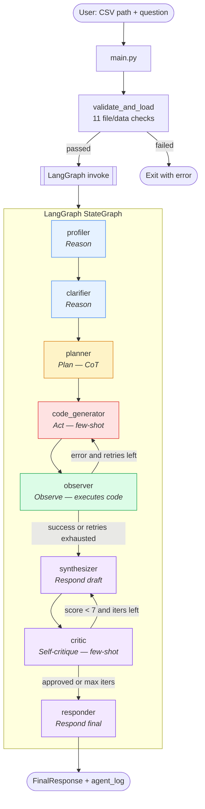

# Data Analysis Agent

An agentic AI application that takes a CSV file plus a natural-language question and
returns structured analytical insights. Built with **LangGraph** and the
**Anthropic Claude API**, it implements a full *Reason → Plan → Act → Observe → Respond*
loop with self-critique, structured outputs, and a sandboxed code execution tool.

# Demo


---

## 1. Chosen domain

**Tabular data analysis on user-supplied CSVs.** The agent is domain-agnostic: it
profiles whatever columns it finds, plans an analysis, writes and executes pandas
code, and reports insights with confidence levels and caveats. Sample datasets
included: the FIFA World Cup 2026 player performance CSV and a minimal test CSV.

## 2. Design rationale

- **Multi-agent-style graph, single LLM provider.** Each stage of the loop is
  a dedicated node with its own system prompt, structured-output schema, and
  narrow responsibility. This keeps prompts short, makes failures localizable,
  and lets us evolve one stage without perturbing the others.
- **Structured outputs everywhere.** All LLM responses are parsed against
  Pydantic models (`AnalysisPlan`, `GeneratedCode`, `InsightReport`,
  `CritiqueResult`, `FinalResponse`). Parsing failures fall back to safe
  defaults so a single malformed response never crashes the run.
- **Advanced technique combo:** self-critique loop + chain-of-thought planning
  + few-shot examples for the two hardest stages (code generation and critique).
- **Deterministic tools, LLM as the reasoner.** The two tools —
  `csv_profiler` (pandas introspection) and `code_executor` (subprocess with
  static-analysis guardrails) — are pure Python. The LLM decides *what* to run;
  Python decides *how* it runs.
- **Fail-safe defaults.** Every node has a try/except that returns a valid
  partial state; the graph never wedges. Static analysis blocks obviously
  dangerous patterns before code ever leaves the sandbox.

## 3. Architecture overview

### Components

| Layer            | Files                                             | Responsibility                                        |
| ---------------- | ------------------------------------------------- | ----------------------------------------------------- |
| CLI entry        | `app/main.py`                                     | Parse args, validate CSV, invoke graph                |
| Validator        | `app/agent/validator.py`                          | 11 CSV/file/data-quality gates                        |
| Graph            | `app/agent/graph.py`                              | LangGraph `StateGraph` with 2 conditional edges       |
| Nodes            | `app/agent/nodes/*.py`                            | profiler → clarifier → planner → code_generator → observer → synthesizer → critic → responder |
| Tools            | `app/tools/csv_profiler.py`, `code_executor.py`   | Dataframe introspection + sandboxed code execution    |
| Prompts          | `app/prompts/system_prompts.py`, `few_shot_examples.py` | One system prompt per node + few-shots for code_generator and critic |
| Schemas          | `app/schemas/state_schema.py`, `output_schemas.py`| TypedDict graph state + Pydantic LLM output models    |
| Config           | `app/config/settings.py`                          | `pydantic-settings` reads `.env` and env vars         |
| Utils            | `app/utils/llm.py`, `logger.py`, `retry.py`       | Centralized LLM client, structured logging            |
| Evaluation       | `app/evaluation/test_scenarios.py`, `evaluator.py`| 5 scenarios + keyword-scored qualitative eval         |

### Architecture diagram (Mermaid)



### The Reason → Plan → Act → Observe → Respond loop

| Loop stage  | Node(s)                     | Output on state                                    |
| ----------- | --------------------------- | -------------------------------------------------- |
| **Reason**  | `profiler`, `clarifier`     | `df_profile`, `clarifying_questions/answers`       |
| **Plan**    | `planner`                   | `analysis_plan` (CoT reasoning in system prompt)   |
| **Act**     | `code_generator`            | `generated_code` (few-shot examples in context)    |
| **Observe** | `observer` + `code_executor`| `execution_result` / `execution_error`, retry gate |
| **Respond** | `synthesizer` → `critic` → `responder` | `insight_report`, `critique_score`, `final_response` |

**Two conditional edges** implement the autonomous loop:

- `observer → code_generator` on execution error, up to `max_retries` (default 3).
- `critic → synthesizer` when `critique_score < critique_approval_threshold` (default 7.0),
  up to `max_critique_iterations` (default 2). This is the **self-critique** advanced technique.

### Tools

- **`csv_profiler.profile_dataframe`** — builds a structured JSON profile (shape,
  dtypes, null %, uniques, sample values, numeric describe stats, categorical
  top-5, datetime detection, warnings). Fed to profiler, planner, code_generator,
  and critic as context.
- **`code_executor.execute_code`** — runs generated pandas code:
  1. **Static analysis** blocks `os.system`, `subprocess`, `requests`, `pickle`,
     `eval`, `exec`, `__import__`, `open(...'w'/'a')`, etc.
  2. **AST parse** catches syntax errors before spawn.
  3. **Subprocess isolation** with `code_execution_timeout` and stdout size cap.
  4. Returns a structured `ExecutionResult` (success, stdout, stderr, truncated, error_type).

## 4. Prompt engineering

- **System prompts per stage** in `app/prompts/system_prompts.py` — each is short,
  role-specific, and ends with a **JSON schema the model must return**.
- **Chain-of-thought** is explicit in the planner prompt ("Think step by step: 1…5").
- **Few-shot examples** in `app/prompts/few_shot_examples.py` for the two stages
  where the output shape is hardest: `code_generator` (2 examples of code+JSON)
  and `critic` (2 examples of critique with score + issues + suggestions).
- **Structured output parsing** via Pydantic models with markdown-fence stripping
  and graceful fallbacks in each node's `_parse_*_response` helper.
- **Advanced techniques demonstrated:**
  - **Self-critique loop** — critic scores the insight report on 0–10; if it
    scores below the threshold, the synthesizer re-runs with the issues as
    additional context.
  - **Chain-of-thought** — the planner is instructed to reason step-by-step
    and return its `reasoning` alongside `steps`.
  - **Few-shot prompting** — code_generator and critic each get 2 in-context
    demonstrations before the live request.

## 5. Robustness & error handling

- **LLM retries + timeouts** — all nodes go through `app/utils/llm.get_chat_model()`,
  which configures `max_retries` and `timeout` on `ChatAnthropic`. Transient
  429/5xx/connection errors are retried by the Anthropic SDK before bubbling up.
- **Per-node try/except** — every node wraps its LLM call in try/except, logs
  via `log_error`, and returns a safe fallback (empty insights, default critique,
  etc.). One broken response never wedges the graph.
- **Input validation** — 11 gates in `app/agent/validator.py`: exists, extension,
  size ≤ 50 MB, parse preview, full load, non-empty rows, non-empty cols,
  column-count ≤ 200, row-count ≤ 500K, all-null check, duplicate column names
  (auto-renamed).
- **Code guardrails** — static analysis blocks dangerous patterns; AST parse
  catches syntax errors; subprocess is spawned with a wall-clock timeout;
  stdout is capped at `max_stdout_bytes` and truncated with a flag.
- **Structured-output fallbacks** — each parser returns a safe default on
  malformed JSON so the graph continues.
- **Logging** — every node emits `NODE ENTER` / `NODE EXIT` + tool calls +
  LLM calls + errors. Full trace goes to `agent_run.log` and is also
  accumulated on state as `agent_log` for inspection.

## 6. Evaluation & observability

Five representative scenarios in `app/evaluation/test_scenarios.py`:

| Scenario              | Question                                                       | Evaluates                            |
| --------------------- | -------------------------------------------------------------- | ------------------------------------ |
| `regional_sales`      | Top performing regions by revenue                              | groupby + sort + rank                |
| `department_salary`   | Average salary by department (with nulls)                      | groupby + null handling              |
| `product_totals`      | Total revenue per product                                      | groupby + sum aggregation            |
| `returns_with_nulls`  | Higher return rate, and how did you handle missing data        | derived metric + explicit null caveat|
| `monthly_sales_peak`  | Which month had the highest sales                              | argmax on time-labeled series        |

Each scenario carries an inline CSV, the question, an expected outcome
description, and a keyword list. `evaluator.py` runs the full graph on each,
extracts the natural-language response, computes a keyword-match ratio, and
prints a pass/fail report. Threshold: 0.5.

A **complete execution trace** for the `regional_sales` scenario is included
at `app/evaluation/execution_trace.md`.

## 7. Setup

### Requirements

- Python 3.10+
- An Anthropic API key

### Install

```bash
git clone <repo-url>
cd ensemble_data_analysis_agent

python -m venv venv
source venv/bin/activate
pip install -r app/requirements.txt
```

### Configure

Copy `.env.example` to `.env` and set your key:

```bash
cp .env.example .env
# then edit .env and set ANTHROPIC_API_KEY=sk-ant-...
```

All settings (model name, retry count, timeouts, size limits, critique
threshold, log level) can be overridden in `.env` or as env vars. See
`app/config/settings.py` for defaults.

## 8. Running

### Single question against a CSV

```bash
python -m app.main data/test_data.csv "What are the top performing regions by revenue?"
```

The agent prints CSV validation info, runs the graph, prints the natural-language
final answer, and writes the full reasoning trace to `agent_run.log`.

If the clarifier decides the question is ambiguous, it will prompt for
answers on stdin.

### Evaluation

```bash
python -m app.evaluation.evaluator
```

Runs all five scenarios end-to-end (each triggers real Anthropic API calls) and
prints per-scenario keyword scores + a summary.

## 9. Project structure

```
ensemble_data_analysis_agent/
├── README.md                     # this file
├── .env.example                  # API key placeholder + tunables
├── .gitignore
├── app/
│   ├── main.py                   # CLI entry
│   ├── requirements.txt
│   ├── validator.py              # public re-export
│   ├── agent/
│   │   ├── graph.py              # StateGraph wiring
│   │   ├── validator.py          # CSV + data-quality checks
│   │   └── nodes/                # 8 node functions
│   ├── tools/
│   │   ├── csv_profiler.py       # tool 1: dataframe profile
│   │   └── code_executor.py      # tool 2: sandboxed subprocess
│   ├── prompts/                  # system prompts + few-shot examples
│   ├── schemas/                  # TypedDict state + Pydantic outputs
│   ├── config/settings.py        # pydantic-settings
│   ├── utils/                    # llm client, logger, retry
│   ├── evaluation/
│   │   ├── test_scenarios.py
│   │   ├── evaluator.py
│   │   └── execution_trace.md    # example full run
│   └── tests/                    # pytest unit tests for tools
└── data/                         # sample CSVs
```

## 10. Design decisions worth calling out

- **Why LangGraph rather than raw LangChain agents?** The task is inherently
  a fixed pipeline with two loop-backs (retry on execution error, retry on
  low critique score). A `StateGraph` with conditional edges maps directly onto
  that; a ReAct agent would obscure the flow and make the retry semantics harder
  to reason about.
- **Why subprocess and not `exec()`?** Isolating code execution in a subprocess
  gives us a real timeout and a clean process boundary, so a runaway pandas
  operation cannot hang the agent.
- **Why keep df in state?** The DataFrame is loaded once in the CLI and passed
  through the graph. Nodes that need it (profiler) use it directly; the code
  executor re-reads the CSV so the subprocess is independent — this doubles
  the read but keeps the subprocess simple and stateless.
- **Why max_critique_iterations = 2?** In practice one critique pass fixes
  most vague or overstated insights; a second pass catches the tail. Beyond
  two, empirically the critic and synthesizer start to oscillate.
